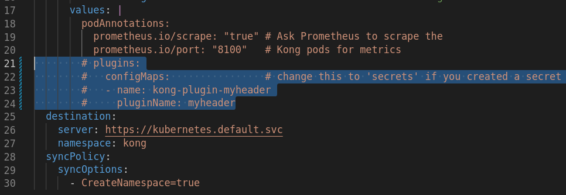

# kind-kong

## Dependencies

- [Docker](https://docs.docker.com/engine/install/)
- [Kind](https://kind.sigs.k8s.io/docs/user/quick-start/#installation)
- [Kubectl](https://kubernetes.io/docs/tasks/tools/)
- [Helm v3](https://helm.sh/docs/intro/install/)


#### Install kubectl and helm using asdf

```bash
asdf plugin add kubectl
asdf plugin add helm
asdf install
```

## Repository configuration

Because in this tutorial we are going to use ArgoCD it's recommended to [fork](https://github.com/arthurbdiniz/kind-kong/fork) the original project to your personal GitHub account.

Once the fork has completed, edit the following files replacing the `repoURL` variable to your GitHub profile.


```bash
git clone git@github.com:<username>/kind-kong.git

# Edit files
# - config/argocd-foo-bar-app.yaml
# - config/argocd-httpbin-app.yaml
# - resources/argocd-app-of-apps.yaml

git add config
git commit -m "Update repoURL to my local GitHub"
git push origin main
```

## Create Kind cluster

```bash
kind create cluster --name kong --config=resources/kind.yaml
kind get kubeconfig --name kong > ~/.kube/kind-kong-config
```

## Setup kubectl

```bash
# Setup kubeconfig
export KUBECONFIG=~/.kube/kind-kong-config

# Testing configuration
kubectl get nodes
```

## MetalLB setup address pool used by loadbalancers

To complete layer2 configuration, we need to provide metallb a range of IP addresses it controls.
We want this range to be on the docker kind network.

```bash
docker network inspect -f '{{.IPAM.Config}}' kind
```

Edit the file [argocd-metallb.yaml](config/argocd-metallb.yaml) adding the ip range you want.


## Setup `/etc/hosts`

> /etc/hosts
```bash
192.168.32.2	httpbin.local
192.168.32.2	grafana.local
192.168.32.2	prometheus.local
192.168.32.2	argocd.local
```

## Install ArgoCD

```bash
helm repo add argo https://argoproj.github.io/argo-helm
helm repo update

helm install argo-cd argo/argo-cd --create-namespace --namespace argocd --version 4.5.7 --values resources/argocd-values.yaml

# Check pods
kubectl get pod -n argocd --watch
```

#### Login to argocd

The initial password for the admin account is auto-generated and stored as clear text in the field password in a secret named argocd-initial-admin-secret in your Argo CD installation namespace.

You can simply retrieve this password using kubectl:

```bash
kubectl -n argocd get secret argocd-initial-admin-secret -o jsonpath="{.data.password}" | base64 -d; echo
```

#### Port Forwarding

> On a secondary terminal

```bash
kubectl port-forward service/argo-cd-argocd-server -n argocd 8080:443
```

Go to the argocd webpage [https://localhost:8080](https://localhost:8080) and sync the Argo Application `app-of-apps`.

## Deploy app of apps

```bash
kubectl -n argocd apply -f resources/argocd-app-of-apps.yaml
```

## Expose argocd with kong

```bash
kubectl -n argocd patch deployment argo-cd-argocd-server --type json \
    -p='[ { "op": "replace", "path":"/spec/template/spec/containers/0/command","value": ["argocd-server","--staticassets","/shared/app","--repo-server","argo-cd-argocd-repo-server:8081","--dex-server","http://argo-cd-argocd-dex-server:5556","--logformat","text","--loglevel","info","--redis","argo-cd-argocd-redis:6379","--insecure"] }]'
```

> This command could take some time to reload the Pod.

## Services URLs

- [argocd](https://argocd.local)
- [httpbin](https://httpbin.local)
- [prometheus](https://prometheus.local)
- [grafana](https://grafana.local)
    - Username: `admin`
    - Password: `kong`

## Deploy native plugins

```
kubectl apply -n httpbin -f kong-plugins/rate-limiting.yaml
kubectl apply -f kong-plugins/prometheus.yaml
```

## Custom plugin

The custom plugin is located at [myheader](myheader) folder.

#### Create a ConfigMap or Secret with the plugin code

Next, we are going to create a ConfigMap or Secret based on the plugin code.

Please ensure that this is created in the same namespace as the one in which Kong is installed.

```bash
# using ConfigMap; replace `myheader` with the name of your plugin
kubectl create configmap kong-plugin-myheader --from-file=myheader -n kong

# OR using Secret
kubectl create secret generic -n kong kong-plugin-myheader --from-file=myheader
```

#### Install plugin Kong

Edit/uncomment the Kong deployment configuration to install the custom plugin under [config/argocd-kong.yaml](config/argocd-kong.yaml)



Add, commit and push your changes to your remote git repository.

```bash
git add config/argocd-kong.yaml
git commit -m "configure myheader custom kong plugin"
git push origin main
```

Then reload Kong deployment inside ArgoCD.

Apply the CRD to kubernetes API.

```bash
kubectl apply -n httpbin -f kong-plugins/custom.yaml
```

## Cleanup Kind

```bash
kind delete cluster --name kong
```

## Author

Managed by [Arthur Diniz](https://github.com/arthurbdiniz) and [Claudio Oliveira](https://github.com/claudioed).

## License

Apache 2 Licensed. See [LICENSE](https://github.com/arthurbdiniz/kind-kong/blob/master/LICENSE) for full details.